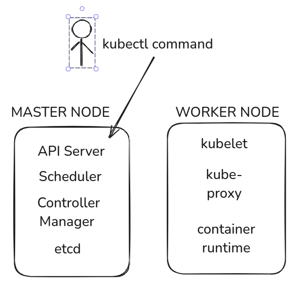

# Your entrance to kubernetes

Hello everybody, I am pleased to demonstrate some aspects of Kubernetes (k8s). First of all, I want to talk about the difference between k3s and k8s. k3s works almost with the same functionalities as k8s. However, k3s is lightweight, consumes fewer resources, and you can run it on low configuration systems.

## Table of Contents
- [Architecture](#architecture)
- [Common terms in the world of k8s](#common-terms)
- [Kubeconfig](#kubeconfig)
- [Pods](#pods)
- [ReplicaSet](#replicaset)
- [Deployment](#deployment)
- [Services](#services)
- [Ingress](#ingress)
- [Namespaces](#namespaces)
- [K3d](#k3d)
- [ArgoCD](#argocd)
- [Deploy GitLab using Helm](#deploy-gitlab-using-helm)

## Architecture

k8s follows a master-worker architecture. The master node is responsible for managing the cluster, while the worker nodes run the applications. The key components of the master node include:

- **API Server**: Exposes the Kubernetes API.
- **etcd**: A key-value store for all cluster data.
- **Controller Manager**: Ensures the desired state of the cluster.
- **Scheduler**: Assigns workloads to nodes.

Worker nodes have the following components:

- **Kubelet**: Ensures containers are running in a Pod.
- **Kube-proxy**: Manages network rules.
- **Container Runtime**: Runs the containers (e.g., Docker, containerd).

This architecture ensures high availability, scalability, and efficient management of containerized applications.

 Differences between k8s and k3s

Here are some key dikubectlfferences between Kubernetes (k8s) and k3s:

- **Resource Consumption**: k3s is designed to be lightweight and consume fewer resources compared to k8s.
- **Installation**: k3s has a simplified installation process, making it easier to set up.
- **Components**: k3s combines several components into a single binary, whereas k8s uses multiple binaries.
- **Use Case**: k3s is ideal for edge computing, IoT, and development environments, while k8s is suited for large-scale production environments.
- **Dependencies**: k3s has fewer dependencies and can run on systems with lower specifications.

These differences make k3s a more suitable option for specific scenarios where resource constraints and simplicity are important.

### Example of k8s Architecture

This is an example of Kubernetes (k8s) architecture. Below is a diagram that illustrates the components of the master node and worker node:

In our situation, we have installed k3s, which combines both the master and worker components into a single node. This setup retains the same components but is optimized for lightweight and resource-constrained environments.

## Common terms in the world of k8s

Understanding the terminology used in Kubernetes is crucial for navigating and managing a cluster. Here are some common terms you will encounter:

- **Cluster**: A group of machines (nodes) working together to run applications and manage workloads.
- **Node**: A machine in the cluster. It can be a physical server or a virtual machine.
Control Plane or (Master) Node: Manages the cluster (API server, scheduler, etc.).
Worker or (agent) Node: Runs application workloads (pods).
- **Resources**: These are the objects that you manage in Kubernetes, such as Pods, Services, and Deployments.
- **Components**: These refer to the individual parts that make up the Kubernetes system, including the API Server, etcd, Controller Manager, Scheduler, Kubelet, and Kube-proxy.
- **Objects**: A record of a resource, stored in etcd (Kubernetes' database). Common objects.  include Pods, Services, Deployment and ConfigMaps.
- **Abstraction**: A way to simplify complex concepts by hiding details:
Pods abstract containers.
Deployments abstract pod scaling and updates.
Services abstract networking and load balancing.
- **Manifest**: A YAML/JSON file that defines a resource or object.

These terms are fundamental to understanding how Kubernetes operates and how to interact with it effectively.