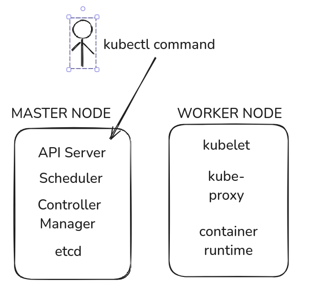
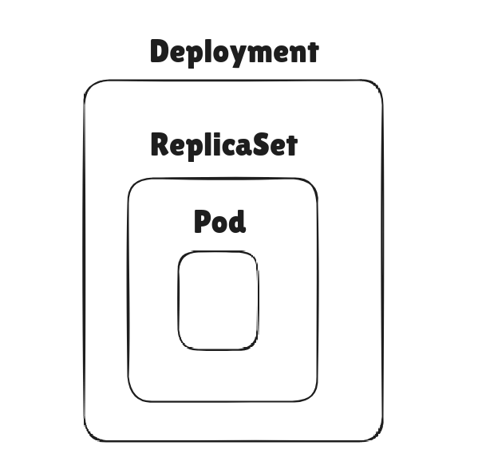
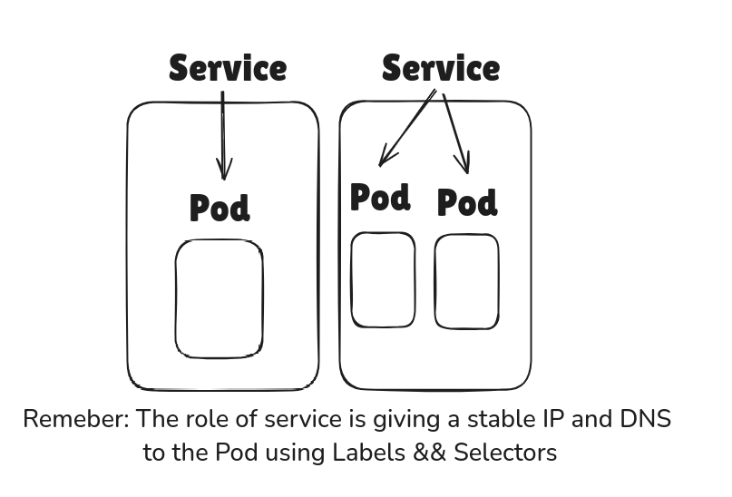
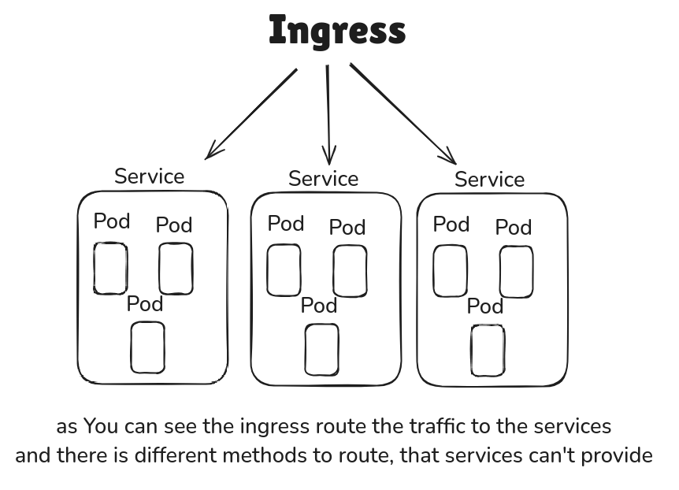
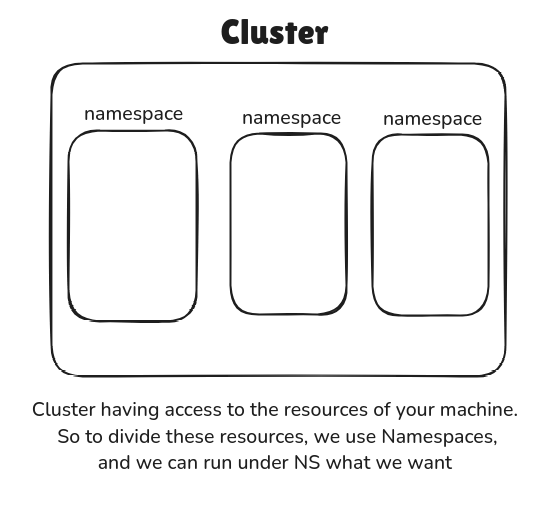

# Your entrance to kubernetes

Hello everybody, I am pleased to demonstrate some aspects of Kubernetes (k8s). First of all, I want to talk about the difference between k3s and k8s. k3s works almost with the same functionalities as k8s. However, k3s is lightweight, consumes fewer resources, and you can run it on low configuration systems.

## Table of Contents
- [Architecture](#architecture)
- [Common terms in the world of k8s](#common-terms-in-the-world-of-k8s)
- [Kubeconfig](#kubeconfig)
- [Labels and Selectors](#labels-and-selectors)
- [Pods](#pods)
- [ReplicaSet](#replicaset)
- [Deployment](#deployment)
- [Services](#services)
- [Ingress](#ingress)
- [Namespaces](#namespaces)
- [K3d](#k3d)
- [ArgoCD](#argocd)
- [Deploy GitLab using Helm](#deploy-gitlab-using-helm)
- [Explain P1](#explain-p1)
- [Explain P2](#explain-p2)
- [Explain P3](#explain-p3)
- [Explain Bonus](#explain-bonus)


## Architecture

k8s follows a master-worker architecture. The master node is responsible for managing the cluster, while the worker nodes run the applications. The key components of the master node include:

- **API Server**: Exposes the Kubernetes API.
- **etcd**: A key-value store for all cluster data.
- **Controller Manager**: Ensures the desired state of the cluster.
- **Scheduler**: Assigns workloads to nodes.

Worker nodes have the following components:

- **Kubelet**: Ensures containers are running in a Pod.
- **Kube-proxy**: Manages network rules.
- **Container Runtime**: Runs the containers (e.g., Docker, containerd).

This architecture ensures high availability, scalability, and efficient management of containerized applications.

 Differences between k8s and k3s

Here are some key dikubectlfferences between Kubernetes (k8s) and k3s:

- **Resource Consumption**: k3s is designed to be lightweight and consume fewer resources compared to k8s.
- **Installation**: k3s has a simplified installation process, making it easier to set up.
- **Components**: k3s combines several components into a single binary, whereas k8s uses multiple binaries.
- **Use Case**: k3s is ideal for edge computing, IoT, and development environments, while k8s is suited for large-scale production environments.
- **Dependencies**: k3s has fewer dependencies and can run on systems with lower specifications.

These differences make k3s a more suitable option for specific scenarios where resource constraints and simplicity are important.

### Example of k8s Architecture

This is an example of Kubernetes (k8s) architecture. Below is a diagram that illustrates the components of the master node and worker node:



In our situation, we have installed k3s, which combines both the master and worker components into a single node. This setup retains the same components but is optimized for lightweight and resource-constrained environments.

For a better understanding, you can watch this [video](https://www.youtube.com/watch?v=umXEmn3cMWY).

## Common terms in the world of k8s

Understanding the terminology used in Kubernetes is crucial for navigating and managing a cluster. Here are some common terms you will encounter:

- **Cluster**: A group of machines (nodes) working together to run applications and manage workloads.
- **Node**: A machine in the cluster. It can be a physical server or a virtual machine.
Control Plane or (Master) Node: Manages the cluster (API server, scheduler, etc.).
Worker or (agent) Node: Runs application workloads (pods).
- **Resources**: These are the objects that you manage in Kubernetes, such as Pods, Services, and Deployments.
- **Components**: These refer to the individual parts that make up the Kubernetes system, including the API Server, etcd, Controller Manager, Scheduler, Kubelet, and Kube-proxy.
- **Objects**: A record of a resource, stored in etcd (Kubernetes' database). Common objects.  include Pods, Services, Deployment and ConfigMaps.
- **Abstraction**: A way to simplify complex concepts by hiding details:</br>
Pods abstract containers.</br>
Deployments abstract pod scaling and updates.</br>
Services abstract networking and load balancing.
- **Manifest**: A YAML/JSON file that defines a resource or object.

These terms are fundamental to understanding how Kubernetes operates and how to interact with it effectively.

## Kubeconfig

The `kubeconfig` file is a configuration file used by Kubernetes to manage cluster access. It contains information about clusters, users, namespaces, and authentication mechanisms. This file is essential for the `kubectl` command-line tool to interact with Kubernetes clusters.

### Structure of a Kubeconfig File

A typical `kubeconfig` file is divided into three main sections:

1. **Clusters**: Defines the clusters that `kubectl` can connect to.
2. **Users**: Specifies the users who can access the clusters.
3. **Contexts**: Combines clusters and users to define a context. A context is a tuple of (cluster, user, namespace).

### Example Kubeconfig File

```yaml
apiVersion: v1
kind: Config
clusters:
- cluster:
    certificate-authority: /path/to/ca.crt
    server: https://kubernetes.example.com
  name: example-cluster
users:
- name: example-user
  user:
    client-certificate: /path/to/client.crt
    client-key: /path/to/client.key
contexts:
- context:
    cluster: example-cluster
    user: example-user
    namespace: default
  name: example-context
current-context: example-context
```

After installing k3s, the default path for this configuration is `/etc/rancher/k3s/k3s.yml`. If you are using a different path, you can use the `kubectl` command with the `--kubeconfig` option followed by the path.


## Labels and Selectors
Labels and selectors are fundamental concepts in Kubernetes, which is a popular container orchestration platform. They play a crucial role in organizing, managing, and deploying applications.

`Labels`
Labels are key-value pairs that are attached to Kubernetes objects, such as pods, services, and deployments. They are used to identify and organize these objects. Labels do not provide uniqueness; instead, they allow you to group and select subsets of objects.

`Example`

```yaml
apiVersion: v1
kind: Pod
metadata:
  name: my-pod
  labels:
    app: my-app
    environment: production
spec:
  containers:
  - name: my-container
    image: my-image
```

`Selectors`
Selectors are used to filter and select Kubernetes objects based on their labels. There are two types of selectors: equality-based and set-based.
- Equality-based selectors: Match objects where the label key has a specific value.
- Set-based selectors: Match objects where the label key's value is in a set of values.
`Example`
```yaml
apiVersion: v1
kind: Service
metadata:
  name: my-service
spec:
  selector:
    app: my-app
  ports:
  - protocol: TCP
    port: 80
    targetPort: 9376
```
Importance of labels and Selectors for some resources like services and deployments.
- Organization: Labels help organize and categorize resources, making it easier to manage large clusters.
- Selection: Selectors allow services, replication controllers, and other resources to dynamically select the appropriate set of pods to manage.
- Scalability: Labels and selectors enable scalable and flexible management of resources, allowing for easy updates and rollouts.
- Isolation: They help in isolating environments (e.g., development, staging, production) by using different labels for different environments.
By using labels and selectors effectively, you can ensure that your Kubernetes deployments and services are well-organized, scalable, and maintainable.


### Pods

A Pod is the smallest and simplest Kubernetes object. It represents a single instance of a running process in your cluster. Pods contain one or more containers, such as Docker containers. When a Pod runs multiple containers, the containers are managed as a single entity and share the Pod's resources, including networking and storage.

#### Key Characteristics of Pods

- **Single IP Address**: Each Pod is assigned a unique IP address, which is shared among all the containers in the Pod.
- **Shared Storage**: Containers in a Pod can share storage volumes, allowing them to access the same data.
- **Lifecycle**: Pods have a defined lifecycle, starting from pending, running, succeeded/failed, and terminating.
- **Ephemeral**: Pods are ephemeral by nature. They are created, destroyed, and re-created as needed by the Kubernetes system.

#### Example Pod Manifest

Here is an example of a simple Pod manifest in YAML format:

```yaml
apiVersion: v1
kind: Pod
metadata:
    name: example-pod
spec:
    containers:
    - name: example-container
        image: nginx:latest
        ports:
        - containerPort: 80
```

In this example, the Pod named `example-pod` runs a single container using the `nginx:latest` image. The container exposes port 80 to the outside world.

Pods are fundamental to Kubernetes and serve as the building blocks for deploying and managing containerized applications.

## ReplicaSet

A ReplicaSet is a Kubernetes resource that ensures a specified number of pod replicas are running at any given time. It is responsible for maintaining the desired state of the application by creating or deleting pods as needed.

### Key Characteristics of ReplicaSet

- **Desired State**: Defines the number of pod replicas that should be running.
- **Self-Healing**: Automatically replaces failed or deleted pods to maintain the desired number of replicas.
- **Label Selector**: Uses label selectors to identify the pods it manages.

### Example ReplicaSet Manifest

Here is an example of a simple ReplicaSet manifest in YAML format:

```yaml
apiVersion: apps/v1
kind: ReplicaSet
metadata:
    name: example-replicaset
spec:
    replicas: 3
    selector:
        matchLabels:
            app: example-app
    template:
        metadata:
            labels:
                app: example-app
        spec:
            containers:
            - name: example-container
                image: nginx:latest
                ports:
                - containerPort: 80
```

In this example, the ReplicaSet named `example-replicaset` ensures that three replicas of the pod with the label `app: example-app` are running. The pod template specifies the container image and port configuration.

### Use Cases for ReplicaSet

- **High Availability**: Ensures that a specified number of pod replicas are always running, providing high availability for applications.
- **Scaling**: Allows for easy scaling of applications by adjusting the number of replicas.
- **Self-Healing**: Automatically recovers from pod failures, maintaining the desired state of the application.

ReplicaSets are fundamental for managing the lifecycle and availability of pods in a Kubernetes cluster, ensuring that applications run reliably and efficiently.

## Deployment

A Deployment is a higher-level Kubernetes resource that provides declarative updates to applications. It manages ReplicaSets and Pods, ensuring that the desired state of the application is maintained. Deployments offer advanced features such as rolling updates and rollbacks, making them a powerful tool for managing application lifecycle.

### Key Characteristics of Deployment

- **Declarative Updates**: Allows you to define the desired state of your application, and Kubernetes will manage the changes to achieve that state.
- **Rolling Updates**: Supports rolling updates to update Pods incrementally with zero downtime.
- **Rollbacks**: Enables rolling back to previous versions of the application in case of issues.
- **Self-Healing**: Automatically replaces failed or deleted Pods to maintain the desired state.

### Example Deployment Manifest

Here is an example of a simple Deployment manifest in YAML format:

```yaml
apiVersion: apps/v1
kind: Deployment
metadata:
    name: example-deployment
spec:
    replicas: 3
    selector:
        matchLabels:
            app: example-app
    template:
        metadata:
            labels:
                app: example-app
        spec:
            containers:
            - name: example-container
                image: nginx:latest
                ports:
                - containerPort: 80
```

In this example, the Deployment named `example-deployment` ensures that three replicas of the Pod with the label `app: example-app` are running. The Pod template specifies the container image and port configuration.

### Relationship with ReplicaSet and Pod

- **ReplicaSet**: The Deployment manages a ReplicaSet, which in turn ensures that the specified number of Pod replicas are running. The ReplicaSet is automatically created and updated by the Deployment.
- **Pod**: The Pods are created and managed by the ReplicaSet. The Deployment defines the Pod template, which the ReplicaSet uses to create the Pods.

### Use Cases for Deployment

- **Application Updates**: Perform rolling updates to update applications with zero downtime.
- **Scaling**: Scale applications up or down by adjusting the number of replicas.
- **Version Control**: Roll back to previous versions of the application if needed.
- **Self-Healing**: Ensure high availability and reliability by automatically replacing failed Pods.

Deployments are essential for managing the lifecycle of applications in a Kubernetes cluster, providing powerful features for updates, scaling, and self-healing.

You can imagine the relation Between Deployment, ReplicaSet and Pod is like that :



## Services

In Kubernetes, a Service is an abstraction that defines a logical set of Pods and a policy by which to access them. Services enable communication between different parts of an application and can expose your application to external traffic.

### Types of Services

1. **ClusterIP**: Exposes the Service on an internal IP in the cluster. This type makes the Service only reachable from within the cluster.
2. **NodePort**: Exposes the Service on each Node's IP at a static port. A ClusterIP Service, to which the NodePort Service routes, is automatically created.
3. **LoadBalancer**: Exposes the Service externally using a cloud provider's load balancer. NodePort and ClusterIP Services, to which the external load balancer routes, are automatically created.
4. **ExternalName**: Maps a Service to the contents of the `externalName` field (e.g., `foo.bar.example.com`), returning a CNAME record with its value.

### Example Service Manifest

Here is an example of a simple Service manifest in YAML format:

```yaml
apiVersion: v1
kind: Service
metadata:
    name: example-service
spec:
    selector:
        app: example-app
    ports:
        - protocol: TCP
            port: 80
            targetPort: 9376
    type: ClusterIP
```

In this example, the Service named `example-service` targets Pods with the label `app: example-app`. It exposes port 80 and forwards traffic to port 9376 on the selected Pods.

### Key Characteristics of Services

- **Stable IP Address**: Services provide a stable IP address and DNS name for a set of Pods, ensuring reliable communication.
- **Load Balancing**: Services distribute traffic across the Pods they target, providing load balancing.
- **Service Discovery**: Kubernetes offers built-in service discovery, allowing Pods to find and communicate with Services using DNS names.

Services are essential for managing communication within a Kubernetes cluster and exposing applications to external users.

This image explain how services can wrapped the Pods:



## Ingress

In Kubernetes, an Ingress is an API object that manages external access to services within a cluster, typically HTTP and HTTPS. Ingress can provide load balancing, SSL termination, and name-based virtual hosting.

### Key Characteristics of Ingress

- **External Access**: Manages external access to services, allowing users to reach applications from outside the cluster.
- **Load Balancing**: Distributes traffic across multiple backend services, providing load balancing.
- **SSL Termination**: Supports SSL/TLS termination, enabling secure communication.
- **Path-Based Routing**: Routes traffic based on URL paths, allowing multiple services to be accessed through a single IP address.

### Example Ingress Manifest

Here is an example of a simple Ingress manifest in YAML format:

```yaml
apiVersion: networking.k8s.io/v1
kind: Ingress
metadata:
    name: example-ingress
spec:
    rules:
    - host: example.com
        http:
            paths:
            - path: /
                pathType: Prefix
                backend:
                    service:
                        name: example-service
                        port:
                            number: 80
```

In this example, the Ingress named `example-ingress` routes traffic from `example.com` to the `example-service` on port 80.

### Ingress Controllers

To use Ingress, you need an Ingress Controller, which is responsible for fulfilling the Ingress rules. Popular Ingress Controllers include:

- **NGINX Ingress Controller**: A widely used Ingress Controller based on NGINX.
- **Traefik**: A modern HTTP reverse proxy and load balancer.
- **HAProxy**: A reliable, high-performance TCP/HTTP load balancer.

### Use Cases for Ingress

- **Single Entry Point**: Provides a single entry point for accessing multiple services within the cluster.
- **Secure Communication**: Enables SSL/TLS termination for secure communication.
- **Traffic Management**: Manages and routes traffic based on URL paths and hostnames.
- **Load Balancing**: Distributes traffic across multiple backend services for high availability.

Ingress is a powerful tool for managing external access to services in a Kubernetes cluster, providing advanced routing, load balancing, and security features.

This example Show The idea that ingress Brigns:



## Namespaces

Namespaces in Kubernetes are a way to divide cluster resources between multiple users or teams. They provide a mechanism for isolating groups of resources within a single cluster, allowing for better organization and management.

### Key Characteristics of Namespaces

- **Isolation**: Namespaces provide a level of isolation for resources, making it easier to manage and secure different environments (e.g., development, staging, production).
- **Resource Quotas**: You can set resource quotas on namespaces to limit the amount of resources (CPU, memory, etc.) that can be consumed.
- **Access Control**: Role-Based Access Control (RBAC) can be applied to namespaces to control access to resources within them.
- **Scoped Resources**: Resources like Pods, Services, and Deployments are namespace-scoped, meaning they exist within a specific namespace.

### Example Namespace Manifest

Here is an example of a simple Namespace manifest in YAML format:

```yaml
apiVersion: v1
kind: Namespace
metadata:
    name: example-namespace
```

In this example, a Namespace named `example-namespace` is created.

### Using Namespaces

To create a namespace, you can use the `kubectl` command:

```sh
kubectl create namespace example-namespace
```

To list all namespaces in the cluster:

```sh
kubectl get namespaces
```

To deploy resources into a specific namespace, you can specify the namespace in the resource manifest or use the `--namespace` flag with `kubectl` commands:

```sh
kubectl apply -f resource.yaml --namespace=example-namespace
```

### Use Cases for Namespaces

- **Environment Separation**: Separate resources for different environments (e.g., dev, test, prod) within the same cluster.
- **Multi-Tenancy**: Support multiple teams or projects within a single cluster, providing isolation and resource management.
- **Resource Management**: Apply resource quotas and limits to control resource usage within namespaces.
- **Access Control**: Implement fine-grained access control using RBAC to manage permissions within namespaces.

Namespaces are a powerful feature in Kubernetes that help organize and manage resources efficiently, providing isolation, resource management, and access control.

This diagram illustrates the concept of namespaces:



## K3d

K3d is a lightweight wrapper to run k3s (Rancher's minimal Kubernetes distribution) in Docker. It simplifies the process of creating and managing k3s clusters in Docker containers, making it an excellent tool for local development and testing.

### Key Features of K3d

- **Lightweight**: K3d leverages k3s, which is designed to be lightweight and resource-efficient.
- **Docker Integration**: Runs k3s clusters inside Docker containers, making it easy to set up and tear down clusters.
- **Multi-Node Clusters**: Supports creating multi-node clusters for testing and development.
- **Port Mapping**: Allows mapping ports from the host to the k3s cluster, facilitating access to services running in the cluster.
- **Easy Management**: Provides simple commands to create, delete, start, and stop clusters.

### Installing K3d

To install k3d, you can use the following command:

```sh
curl -s https://raw.githubusercontent.com/rancher/k3d/main/install.sh | bash
```

Alternatively, you can use Homebrew on macOS:

```sh
brew install k3d
```

### Creating a Cluster

To create a k3d cluster, use the following command:

```sh
k3d cluster create mycluster
```

This command creates a single-node k3s cluster named `mycluster`.

### Managing Clusters

- **List Clusters**: To list all k3d clusters, use:

    ```sh
    k3d cluster list
    ```

- **Delete Cluster**: To delete a cluster, use:

    ```sh
    k3d cluster delete mycluster
    ```

- **Start Cluster**: To start a stopped cluster, use:

    ```sh
    k3d cluster start mycluster
    ```

- **Stop Cluster**: To stop a running cluster, use:

    ```sh
    k3d cluster stop mycluster
    ```

### Example: Creating a Multi-Node Cluster

To create a multi-node k3d cluster with one master and two worker nodes, use the following command:

```sh
k3d cluster create mycluster --servers 1 --agents 2
```

### Accessing the Cluster

After creating a k3d cluster, you can access it using `kubectl`. The kubeconfig file is automatically updated to include the new cluster context. To switch to the k3d cluster context, use:

```sh
kubectl config use-context k3d-mycluster
```

### Use Cases for K3d

- **Local Development**: Quickly spin up Kubernetes clusters for local development and testing.
- **CI/CD Pipelines**: Integrate k3d into CI/CD pipelines to test Kubernetes deployments.
- **Learning and Experimentation**: Use k3d to learn Kubernetes concepts and experiment with different configurations.

K3d is a powerful tool that simplifies the process of running k3s clusters in Docker, making it ideal for local development, testing, and learning Kubernetes.

## ArgoCD

ArgoCD is a declarative, GitOps continuous delivery tool for Kubernetes. It automates the deployment of applications to Kubernetes clusters by tracking changes in a Git repository and synchronizing the cluster state with the desired state defined in the repository.

### Key Features of ArgoCD

- **Declarative GitOps**: Uses Git repositories as the source of truth for application definitions, configurations, and environments.
- **Automated Sync**: Continuously monitors Git repositories and automatically synchronizes the cluster state with the desired state.
- **Application Rollbacks**: Supports easy rollbacks to previous application versions in case of issues.
- **Multi-Cluster Support**: Manages applications across multiple Kubernetes clusters from a single ArgoCD instance.
- **User Interface**: Provides a web-based UI for visualizing and managing application deployments.
- **Access Control**: Integrates with Kubernetes RBAC for fine-grained access control.

### Installing ArgoCD

To install ArgoCD, you can use the following commands:

```sh
kubectl create namespace argocd
kubectl apply -n argocd -f https://raw.githubusercontent.com/argoproj/argo-cd/stable/manifests/install.yaml
```

### Accessing the ArgoCD UI

To access the ArgoCD UI, you need to expose the ArgoCD server. You can use port forwarding for this purpose:

```sh
kubectl port-forward svc/argocd-server -n argocd 8080:443
```

Then, open your browser and navigate to `https://localhost:8080`.

### Logging into ArgoCD

The default username is `admin`. To get the initial password, run the following command:

```sh
kubectl get secret argocd-initial-admin-secret -n argocd -o jsonpath="{.data.password}" | base64 -d
```

### Creating an Application

To create an application in ArgoCD, you can use the ArgoCD CLI or the web UI. Here is an example using the CLI:

```sh
argocd app create my-app \
    --repo https://github.com/my-org/my-repo.git \
    --path my-app-path \
    --dest-server https://kubernetes.default.svc \
    --dest-namespace default
```

### Syncing an Application

To manually sync an application, use the following command:

```sh
argocd app sync my-app
```

### Monitoring Application Status

To check the status of an application, use the following command:

```sh
argocd app get my-app
```

### Use Cases for ArgoCD

- **Continuous Delivery**: Automate the deployment of applications to Kubernetes clusters using GitOps principles.
- **Environment Management**: Manage multiple environments (e.g., dev, staging, prod) with separate Git branches or repositories.
- **Disaster Recovery**: Quickly recover from failures by rolling back to previous application versions.
- **Compliance and Auditing**: Maintain a clear audit trail of changes to application configurations and deployments.

ArgoCD is a powerful tool for implementing GitOps workflows in Kubernetes, providing automated, declarative, and continuous delivery of applications.

This diagram illustrates the ArgoCD workflow:


## Deploy GitLab using Helm

Helm is a package manager for Kubernetes that simplifies the deployment and management of applications. GitLab, a popular DevOps platform, can be deployed on Kubernetes using Helm charts, which provide a convenient way to package and deploy GitLab and its dependencies.

### Prerequisites

Before deploying GitLab using Helm, ensure you have the following prerequisites:

- A running Kubernetes cluster
- Helm installed on your local machine
- kubectl configured to interact with your Kubernetes cluster

### Adding the GitLab Helm Repository

First, add the GitLab Helm repository to your Helm configuration:

```sh
helm repo add gitlab https://charts.gitlab.io/
helm repo update
```

### Creating a Namespace for GitLab

Create a dedicated namespace for GitLab to keep its resources organized:

```sh
kubectl create namespace gitlab
```

### Installing GitLab

To install GitLab using Helm, use the following command:

```sh
helm install gitlab gitlab/gitlab --namespace gitlab
```

This command installs GitLab with the default configuration. You can customize the installation by providing a values file with your specific configuration options.

### Customizing the GitLab Installation

To customize the GitLab installation, create a `values.yaml` file with your desired configuration. Here is an example of a basic `values.yaml` file:

```yaml
global:
    hosts:
        domain: example.com
    ingress:
        configureCertmanager: false
        annotations:
            kubernetes.io/ingress.class: nginx
        tls:
            enabled: true
            secretName: gitlab-tls
certmanager-issuer:
    email: your-email@example.com
```

Install GitLab with the custom values file:

```sh
helm install gitlab gitlab/gitlab --namespace gitlab -f values.yaml
```

### Accessing GitLab

After the installation is complete, you can access GitLab using the provided domain name. If you are using a local cluster or do not have a domain name, you can use port forwarding to access GitLab:

```sh
kubectl port-forward --namespace gitlab svc/gitlab-webservice-default 8080:8181
```

Then, open your browser and navigate to `http://localhost:8080`.

### Initial Login

To get the initial root password, run the following command:

```sh
kubectl get secret gitlab-gitlab-initial-root-password -n gitlab -o jsonpath="{.data.password}" | base64 -d
```

Use the username `root` and the retrieved password to log in to GitLab.

### Upgrading GitLab

To upgrade GitLab to a newer version, update the Helm repository and run the upgrade command:

```sh
helm repo update
helm upgrade gitlab gitlab/gitlab --namespace gitlab -f values.yaml
```

### Uninstalling GitLab

To uninstall GitLab and remove all its resources, use the following command:

```sh
helm uninstall gitlab --namespace gitlab
kubectl delete namespace gitlab
```

### Use Cases for Deploying GitLab with Helm

- **CI/CD Pipelines**: Set up GitLab CI/CD pipelines to automate the build, test, and deployment processes.
- **Source Code Management**: Host and manage your source code repositories with GitLab.
- **DevOps Platform**: Utilize GitLab's comprehensive DevOps features, including issue tracking, code review, and project management.

Deploying GitLab using Helm provides a scalable and manageable way to leverage GitLab's powerful DevOps capabilities within a Kubernetes environment.

## Explain P1

They asks here to implement the concept of k8s by creating two nodes , first one is `master node` and second one is `worker node` and assign it to the `master node`.

in the first page of k3s you will find two methods of usage of k3s , you can run it as `single node server`
or you can create more `nodes` by using different links inside each nodes.

the `server.sh` script is responsible for installing k3s as `master node`
the `worker.sh` scirpt is responsible for installing k3s as `worker node`

to Run it:

```sh
vagrant up
```
and connect to the master node By
```sh
vagrant ssh abouhmadS
```
to make sure that everything is configured well inside the `master node` machine write :
```sh
kubectl get nodes
```
it must display two nodes , or something wrong happend.

## Explain P2

This side of the project require from you to understand what is `pod, ReplicaSet, deployment, service and ingress`, if you just read what i said about them above you will find it a peace of cake.is

This part demonstrates the power of Ingress. We use it to route different hostnames to their respective services.

Run The command below 
```sh
vagrant up
```
You can now go to the browser and use the `IP` of the machine in my case i used: `http://192.168.56.110`
And you can try accessing other services using curl:

```sh
curl -H "Host: app1.com" http://192.168.56.110/
curl -H "Host: app2.com" http://192.168.56.110/
```


## Explain P3
This part of the project involves setting up ArgoCD to watch a Github instance running on your Kubernetes cluster. The goal is to automate the deployment of applications by synchronizing the cluster state with the desired state defined in a Github repository.

### Use Cases for ArgoCD with Github

- **Continuous Delivery**: Automate the deployment of applications using GitOps principles.
- **Environment Management**: Manage multiple environments with separate Git branches or repositories.
- **Disaster Recovery**: Quickly recover from failures by rolling back to previous application versions.
- **Compliance and Auditing**: Maintain a clear audit trail of changes to application configurations and deployments.

`You need to read the scirpt.sh file insdie scripts folder on p3 to know every step what do`

By integrating ArgoCD with Github, you can achieve a robust and automated continuous delivery pipeline for your Kubernetes applications.

## Explain Bonus

The bonus part is similar to what we did in `p3` instead of using Github as the single source of the truth, we'll bring an instance of gitlab using `Helm` and make `argocd` watch this local repo, Just read the script called `install-gitlab.sh` that's what new here .

### What is Helm
Helm is a package manager for Kubernetes that simplifies the deployment and management of applications. It uses Helm charts, which are pre-configured templates of Kubernetes resources, to package and deploy applications and their dependencies. Helm helps automate the process of defining, installing, and upgrading applications in a Kubernetes cluster, making it easier to manage complex deployments.

### Key Features of Helm

- **Charts**: Helm uses charts to define, install, and upgrade applications. Charts are collections of files that describe a related set of Kubernetes resources.
- **Versioning**: Helm supports versioning of charts, allowing you to manage and roll back application versions easily.
- **Dependency Management**: Helm manages dependencies between charts, ensuring that all required components are installed and configured correctly.
- **Templating**: Helm uses Go templates to create customizable and reusable Kubernetes manifests.
- **Release Management**: Helm tracks the state of each deployment as a release, enabling easy updates and rollbacks.

### Example Helm Commands

- **Install a Chart**: To install an application using a Helm chart, use the following command:
    ```sh
    helm install my-release my-chart
    ```

- **Upgrade a Release**: To upgrade an existing release to a new version of the chart, use:
    ```sh
    helm upgrade my-release my-chart
    ```

- **Rollback a Release**: To roll back a release to a previous version, use:
    ```sh
    helm rollback my-release 1
    ```

Helm is a powerful tool that streamlines the deployment and management of applications in Kubernetes, providing a consistent and repeatable way to manage complex applications and their dependencies.


### Conclusion
In this document, we explored various aspects of Kubernetes (k8s) and its lightweight counterpart, k3s. We began by understanding the architecture of Kubernetes, including the roles of master and worker nodes, and the key components involved. We then delved into common Kubernetes terms, kubeconfig files, and the importance of labels and selectors.

We covered essential Kubernetes resources such as Pods, ReplicaSets, Deployments, Services, and Ingress, providing examples and use cases for each. We also discussed the concept of Namespaces for resource isolation and management.

Additionally, we introduced k3d, a tool for running k3s clusters in Docker, and ArgoCD, a GitOps continuous delivery tool for Kubernetes. We demonstrated how to deploy GitLab using Helm and integrate it with ArgoCD for automated application deployment.

Finally, we provided explanations for specific project tasks, including setting up a master-worker node configuration, using Ingress for routing, and leveraging ArgoCD with GitHub and GitLab for continuous delivery.

Overall, this document serves as a comprehensive guide to understanding and working with Kubernetes, k3s, k3d, ArgoCD, and Helm, enabling efficient management and deployment of containerized applications.

